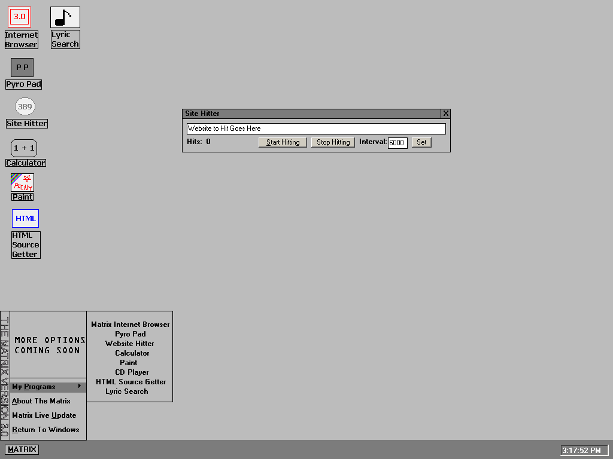



## MATRIX 3\.0 \(Not Finished\)

### Description

I made this code as like a parent to several other programs that are useful, it kind of resembles Windows. If you would like to see this project finished, contact me and we can finish it together! Please Rate My Code!
 
### More Info
 

             |
---                |---
**Submitted On**   |2002-10-12 15:34:24
**By**             |[Jesse Seidel \(Dr\. Fire\)](https://github.com/Planet-Source-Code/PSCIndex/blob/master/ByAuthor/jesse-seidel-dr-fire.md)
**Level**          |Advanced
**User Rating**    |3.7 (11 globes from 3 users)
**Compatibility**  |VB 6\.0
**Category**       |[Complete Applications](https://github.com/Planet-Source-Code/PSCIndex/blob/master/ByCategory/complete-applications__1-27.md)
**World**          |[Visual Basic](https://github.com/Planet-Source-Code/PSCIndex/blob/master/ByWorld/visual-basic.md)
**Archive File**   |[MATRIX\_3\_014523910122002\.zip](https://github.com/Planet-Source-Code/jesse-seidel-dr-fire-matrix-3-0-not-finished__1-39770/archive/master.zip)

